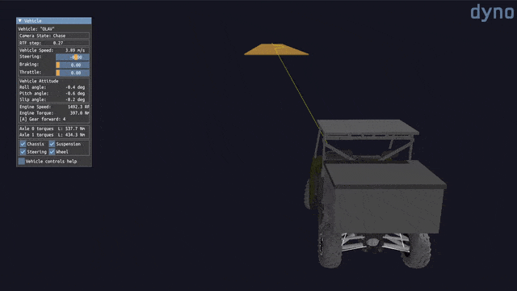

# Overview

## What is DYNO?

DYNO is a toolkit for the performance validation of ground vehicles. DYNO is
built on top of the popular multibody dynamics simulation library [Project
Chrono](https://projectchrono.org) and provides users with a convenient
framework to run serial or parallel simulations, postprocess results and
interface with thid-party tools when simulating the performance of manned and
unmanned wheeled or tracked vehicles.

DYNO allows users to:

* 📝 Perform verification studies for ground (wheeled and tracked) vehicles

* ❓ Perform design exploration and uncertainty quantification studies

* 🧭 Validate and test autonomous navigation systems for ground vehicles

* 💾 Generate datasets for high-fidelity multibody dynamics vehicle models

## Features

At this time, DYNO can be used to:

* 🚗 Test ground vehicle models in straight line acceleration and braking tests,
  slope climbing and descent tests, double lane change maneuvers, split friction
  (μ) tests, autonomous single and multiple obstacle avoidance tests.

* 🖹 Generate simulation output in JSON or HDF5 format.

* 📈 Postprocess simulation output directly to Pandas, CSV or PDF (report)
  format.

* 🤖 Simulate autonomous vehicles through a native or co-simulated ROS 2
  interface.

* 📊 Optimization and uncertainty quantification (UQ) studies using Sandia
  National Laboratories Dakota.

# Getting started

## Installing DYNO

To get started using DYNO, you can:

* 🐋 Build and run the bundled Docker image by following the Docker installation
  guide

* 🖥️ Build from source by following the build guide

## Accessing the documentation

You can learn more about how to deploy and use DYNO at
[docs.aarhusrobotics.com/dyno](https://docs.aarhusrobotics.com/dyno).

# Contributing

DYNO is in active development following the ever-changing needs of the small
research group behind it. If you would like to add a new feature, we invite you
to follow the [contribution guidelines](CONTRIBUTING.md) before opening a new
pull request. We are also open to hearing your feedback, bug reports and feature
requests through [GitHub
issues](https://github.com/aarhus-robotics/dyno/issues).

# Repository structure

The repository contains the following:

* 🐍 A Python package (pydyno) for postprocessing the results under
  [pydyno/](pydyno/).

* 🐋 The source files for the Docker image under [docker/](docker/).

* 🚗 A set of examples under [examples/](examples/).

* 📓 A paper for the Journal of Open Source Software (JOSS) under
  [paper/](paper/).

* 🤖 A collection of ROS package to interface DYNO with ROS under [ros/](ros/).
  Please note that DYNO uses a separate ROS interface than Project Chrono.

# License

DYNO is licensed using the permissive [MIT software license](LICENSE). You can
do whatever you want as long as you include the original copyright and license
notice in any copy of the software/source. Please refer to the license full text
for more information the license terms.
