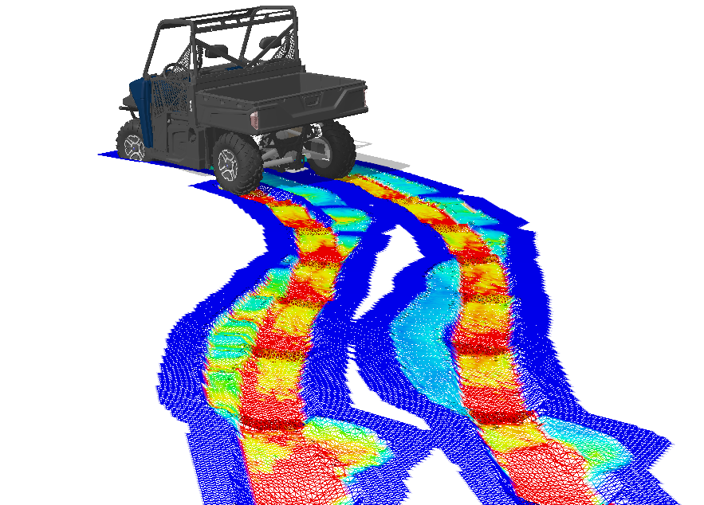

:html_theme.sidebar_secondary.remove:

{align=center}

# DYNO documentation

## What is DYNO?

DYNO is a toolkit for the performance validation of ground vehicles built on top
of [Project Chrono](https://projectchrono.org).

DYNO allows users to:

* Perform verification studies for ground (wheeled and tracked) vehicles

* Perform design exploration and uncertainty quantification studies

* Validate and test autonomous navigation systems for ground vehicles

* Generate datasets for high-fidelity multibody dynamics vehicle models

## Features

At this time, DYNO can be used to:

* 🚗 Test ground vehicle models in straight line acceleration and braking tests,
  slope climbing and descent tests, double lane change maneuvers, split friction
  (μ) tests, drawbar-pull tests, autonomous single and multiple obstacle
  avoidance tests.

* 🖹 Generate simulation output in JSON or HDF5 format.

* 📈 Postprocess simulation output directly to Pandas, CSV or PDF (report) format.

* 🤖 Simulate autonomous vehicles through a native or co-simulated ROS 2 interface.

* 📊 Optimization and uncertainty quantification (UQ) studies using Sandia
  National Laboratories Dakota.

```{toctree}
:hidden:
pages/getting-started/index.md
pages/user-guide/index.md
pages/examples/index.md
pages/api/index.md
```
