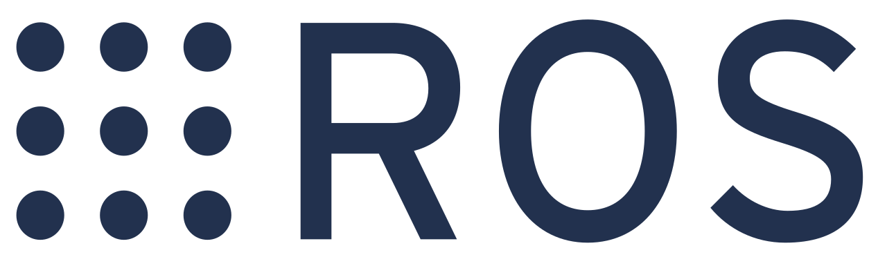

# Cosimulation with ROS



## Overview

DYNO includes a set of ROS packages to facilitate autonomous driving
simulations. These packages allow for easy interfacing of the simulation with
ROS applications and the postprocessing of simulation results collected in
Rosbag format. At the time of writing, only simple obstacle avoidance scenarios
are available for simulation in ROS.

:::{important}
It is important to note that the ROS interface from DYNO pre-dates and differs
from the Chrono::ROS module available in Project Chrono. All parameters and
interfaces listed in the following sections strictly apply to the DYNO ROS
packages, and all postprocessing tools included with DYNO only accept Rosbags
generated using the DYNO simulation nodes.
:::

## Available packages

* `dyno_interfaces`: interfaces (messages, services, etc.) for DYNO simulations.
* `dyno_simulation`: nodes to interface DYNO with ROS.
* `dyno_utilities`: recording and postprocessing utilities for DYNO ROS
  packages.

## Nodes

### Cosimulation node

### Native simulation node

The native simulation node allows for direct simulation inside a ROS node. It
provides the best performance, limiting the delays and bandwidth requirements
that come with transferring large messages like point clouds and images. On the
other hand, native nodes require all simulation to happen on the same machine
running ROS.

The vehicle models implemented in DYNO (and, more broadly, the vast majority
of the vehicle models in Chrono::Vehicle) do not support direct speed or
steering angle commands. The native simulation node implements its own speed and
steering controllers achieving closed-loop control through two separate PID
controllers to bridge this gap. The controller gains can be tuned through the
native node parameters, and tick at the same rate as the native node.

Negative simulation rates mean the simulator will run as fast as possible.

#### Parameters

```{csv-table} Native simulation node parameters
:widths: 10, 10, 70, 10
:header-rows: 1

Name,Type,Description,Default value
options,string,Path to the simulation options file,
rates.transforms,double,Rate at which the transforms are published to the TF tree,1000.0
rates.odometry,double,Rate at which the ideal odometry data is published.,100.0
rates.imu,double,Rate at which the ideal inertial measurement unit data is published.,100.0
rates.pointcloud,double,Rate at which the LiDAR point cloud data is published.,10.0
rates.image,double,Rate at which the camera image and info are published.,15.0
rates.controllers,double,Rate at which the speed and steering controllers are ticking.,200.0
controllers.speed.gains.proportional,double,Proportional gain for the speed controller.,0.0002
controllers.speed.gains.integral,double,Integral gain for the speed controller,0.11
controllers.speed.gains.derivative,double,Derivative gain for the speed controller.,0.0
controllers.speed.setpoint.ramp.enabled,bool,Whether or not to ramp the speed setpoint.,true
controllers.speed.setpoint.ramp.magnitude,double,Maximum speed setpoint change between two consecutive controller ticks.,0.05
controllers.speed.limit.integral.enabled,bool,Whether or not the speed controller integral term limiter is enabled.,true
controllers.speed.limit.integral.magnitude,double,Maximum magnitude for the speed controller integral term.,0.3
controllers.steering.gains.proportional,double,Proportional gain for the steering controller.,0.0002
controllers.steering.gains.integral,double,Integral gain for the steering controller,0.11
controllers.steering.gains.derivative,double,Derivative gain for the steering controller.,0.0
controllers.steering.setpoint.ramp.enabled,bool,Whether or not to ramp the steering setpoint.,true
controllers.steering.setpoint.ramp.magnitude,double,Maximum steering setpoint change between two consecutive controller ticks.,0.05
controllers.steering.limit.integral.enabled,bool,Whether or not the steering controller integral term limiter is enabled.,true
controllers.steering.limit.integral.magnitude,double,Maximum magnitude for the steering controller integral term.,0.3
obstacles.message,string,Obstacles message type format.,none
```

#### Subscriptions

```{csv-table} Native simulation node subscriptions
:widths: 20, 30, 50
:header-rows: 1

Topic,Message type,Description
joystick/state,sensor_msgs/msg/Joy,Joystick state for overriding controls.
controls/drive,ackermann_msgs/msg/AckermannDriveStamped,Ackermann command to control the vehicle.
```

#### Publishers

```{csv-table} Native simulation node publishers
:widths: 20, 30, 50
:header-rows: 1

Topic,Message type,Description
/clock,rosgraph_msgs/msg/Clock,Simulation time clock for synchronization.
sensors/inertial_navigation_system/odometry,nav_msgs/msg/Odometry,Ideal odometry from simulation.
sensors/inertial_navigation_system/imu,sensor_msgs/msg/Imu,Ideal inertial measurement unit output from simulation.
sensors/lidar/points,sensor_msgs/msg/PointCloud2,Simulated LiDAR sensor scans.
sensors/camera/mono/image/raw,sensor_msgs/msg/Image,Uncompressed simulated monocular RGB camera image.
sensors/camera/mono/image/info,sensor_msgs/msg/CameraInfo,Simulated camera intrinsics info.
sensors/steering/angle,std_msgs/msg/Float64,Average front axle steering angle (expressed in radians).
controls/throttle,std_msgs/msg/Float64,Normalized throttle effort.
controls/brake,std_msgs/msg/Float64,Normalized brake effort.
controls/steering,std_msgs/msg/Float64,Normalized steering effort.
models/joints/steering,sensor_msgs/msg/JointState,Front axle wheels joint state used for visualization in RViz.
```
