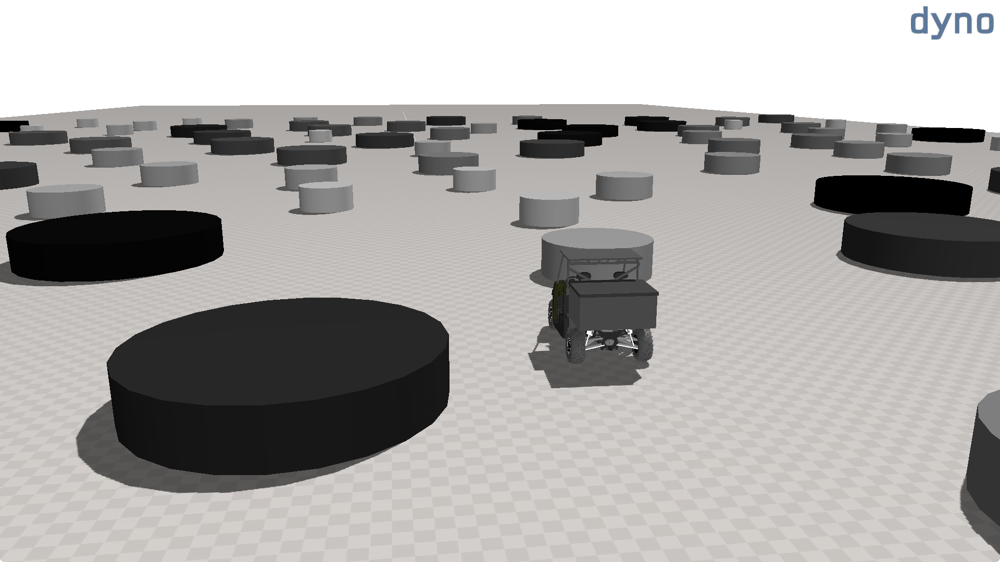

## Summary

DYNO is an extensible toolkit designed for the performance validation of ground
vehicles. It builds upon the high-fidelity simulation capabilities of the
Chrono::Vehicle [@serban2019chrono] module of the Project Chrono
[@tasora2016chrono] middleware, a robust and mature open-source multi-physics
library, to provide a diverse set of simulation scenarios of common interest to
scientists, engineers and students engaged in manned and autonomous vehicle
simulation.

DYNO provides a unified entry point for executing and post-processing a tightly
integrated suite of test scenarios designed to evaluate vehicle performance. The
framework incorporates templated scenarios encompassing handling performance
assessment, terrain mobility analysis (Figure \ref{fig:dyno-terrain-mobility}),
and autonomous navigation. Handling evaluations include standardized tests such
as straight-line acceleration and braking, grade climbing and descent (Figure
\ref{fig:dyno-parameter-study}), double lane change (Figure
\ref{fig:dyno-double-lane-change}), split-friction surface braking and
wall-to-wall turning maneuvers. Beyond these conventional validation tests, DYNO
also supports single and multiple static obstacle avoidance scenarios (Figure
\ref{fig:dyno-obstacle-field}), enabling the evaluation of navigation algorithms
for autonomous guided vehicle.

Users define vehicle data, test conditions, and simulation parameters using a
human-readable JSON format. Upon execution, the software performs the simulation
and produces standardized output files in either JSON or HDF5 format. These
results can subsequently be processed with the integrated post-processing tool
or independently to extract detailed vehicle and scenario performance metrics.

{height="180pt"}

The framework is intended to be both quick to deploy and straightforward to
operate, while maintaining an extensible API for scenario development. Users can
readily integrate custom vehicle and sensor models from Project Chrono, adapt
existing scenarios, or construct new ones by reusing the underlying
instantiation framework and simulation output mechanisms. In addition, DYNO
offers optional logging and visualization features, making it well-suited for
large-scale parallel simulations.

DYNO is implemented entirely in C++ and is accompanied by a suite of
Python-based utilities for pre- and post-processing. The software can be
compiled and executed natively on both Windows and Linux platforms, and is
additionally available through Docker images configured to support the
requirements of both developers and end users.

DYNO also offers native integration with [Dakota](https://dakota.sandia.gov/)
[@adams2024dakota], a powerful toolkit for optimization and uncertainty
quantificaiton, through dedicated pre- and post-processing utilities that
streamline the configuration of study cases. Furthermore, DYNO independently
interfaces with the widely adopted open-source robotics middleware
[ROS](https://www.ros.org/) [@macenski2022robot], providing a
software-in-the-loop testbed for the validation of autonomous navigation
algorithms. Vehicle, sensor and scenario data are directly serializable to
Rosbag format, thereby facilitating integration with existing mobile robotics
workflows.

{height="180pt"}

## Statement of need

Multibody vehicle simulation enables detailed analysis of the dynamic behaviour
of a vehicle under realistic operating conditions. Over the past four decades,
the application of multibody vehicle dynamics simulations have become
increasingly prevalent. These simulations enables scientists and engineers to
analyze the dynamic behaviour of vehicles under realistic operating conditions,
supporting the design, validation and optimization of these systems. Yet,
despite the growing popularity of these methodologies, the software tools
required to conduct rigorous vehicle design evaluations remain predominantly
proprietary and costly. When integrated solutions are available, these are often
middlewares requiring significant instrumentation efforts before any result can
be generated.

In more recent years, the growing interest in autonomous vehicle mobility has
further exacerbated the complexity of vehicle simulation software stacks, often
necessitating distinct applications for modeling the dynamics of the vehicle,
the environment, and the sensor systems. This fragmentation has further
compelled small groups of researchers and engineers to develop ad-hoc
frameworks, often involving significant trade-offs and facing poor reusability.

The transparency and flexibility inherent in open source software present
particular advantages for small research teams engaged in vehicle simulation,
especially those seeking to avoid the limitations associated with procuring or
integrating commercial simulation platforms. Researchers now have unprecedented
access to high-fidelity physics simulation software [@collins2021review], with a
growing number of software frameworks available under open-source licenses
[@li2024choose] [@zhao2024survey] [@silva2024realistic]. However, comprehensive
solutions that facilitate rapid and automated processes for verification,
validation, simulation, and interfacing in high-fidelity vehicle modelling
remain limited in availability, fragmented in scope, and often difficult to
implement.

Several widely adopted simulation platforms, most notably AirSim
[@shah2017airsim], CARLA [@dosovitskiy2017carla], and the now-discontinued LGSVL
[@rong2020lgsvl], are built upon proprietary game engines. While these
frameworks offer considerable extensibility and deliver high levels of visual
fidelity, often a critical requirement for virtual prototypes [@gorsich2020use],
they inherit the deployment complexity and licensing constraints associated with
their underlying engines. Other simulation frameworks concentrate on narrowly
defined scenarios, such as traffic modelling (e.g. SUMO
[@lopez2018microscopic1], SUMMIT [@cai2020summit]) or low-speed robotic vehicle
simulation (e.g. Gazebo [@koenig2004design], Modular [@echeverria2011modular]).
The principal objective of these platforms is to deliver detailed testing
environments or straightforward integration with existing software frameworks.
However, their emphasis lies predominantly on system-level performance, with
comparatively limited attention devoted to high-fidelity vehicle dynamics
simulation.

{height="180pt"}

A more recent initiative, the MSU Autonomous Vehicle Simulator
[@goodin2022simulation], provides a fully integrated and open source solution
for vehicle simulation that functions independently of proprietary game engines.
The principal focus of this platform, however, lies in the evaluation of
autonomous perception and navigation systems, supported by detailed sensor
modelling and accurate terrain and environment representation, rather than in
high-fidelity vehicle dynamics simulation.

DYNO is designed to address the gap in accessible high-fidelity vehicle
simulation by offering researchers and engineers a comprehensive,
self-contained, and extensible platform. Built upon established simulation
frameworks and libraries, it provides a streamlined and tightly integrated
environment for vehicle performance analysis. The toolkit seeks to mitigate the
considerable development overhead traditionally associated with initiating
complex vehicle simulations using open-source middlewares, lowering the entry
barrier for configuring advanced multibody simulations and facilitating rigorous
validation of vehicle performance under both human-driven and autonomous
operating conditions.

{height="180pt"}

# References