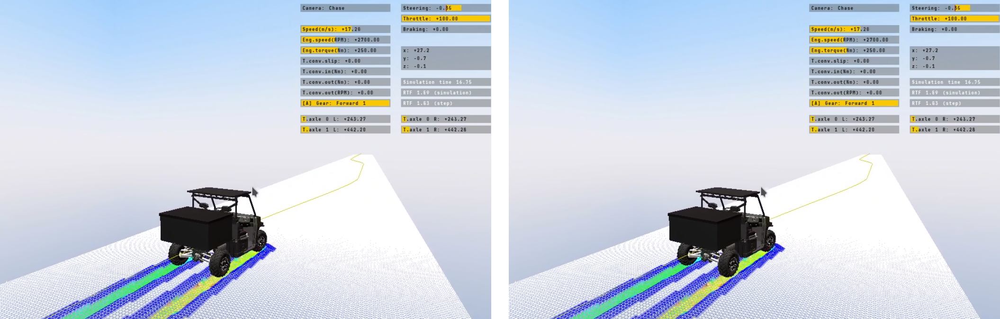

# Summary

Multibody vehicle simulation enables detailed analysis of the dynamic behaviour
of a vehicle under realistic operating conditions. Throughout the last decades,
such analyses have become increasingly common, aiding manufacturers and system
integrators in the design and validation of vehicle systems. Despite the
popularity of these methods, the software tools necessary to perform rigorous
vehicle design evaluations are often proprietary and costly solutions, leaving
small research groups to develop their own solutions from the bottom up.

Additionally, the growing interest in autonomous vehicle mobility has
exacerbated the complexity of software stacks, often necessitating distinct
applications for modeling the dynamics of the vehicle, the environment, and the
sensor systems. This fragmentation compels researchers and engineers to develop
custom solutions, often involving significant trade-offs due to the integration
challenges inherent in these systems.

The transparency and flexibility of open source software can allow small
research teams to tackle researching complex vehicle behaviour research
questions without the constraints of acquiring or interfacing commercial vehicle
simulation software. Yet, the available solutions allowing for quick and
automated verification, validation, simulation and interfacing of high-fidelity
vehicle simulation are few, sparse and challenging to deploy.

DYNO aims to bridge the gap and provide researchers with an easy, expandable,
and out-of-the-box vehicle simulation solution, by providing a simple and
tightly interfaced solution built on tried and tested simulation libraries that
works "out of the box".

# Statement of need

> What problems the software is designed to solve

DYNO is written entirely in C++, and includes a set of Python pre- and
post-processing utilities, and comes bundled with Docker images specifically
tailored to developers or to end users.

> State of the field

> How does it relate to other work?

Researchers have access to more high-fidelity physics simulation software than
ever before [@collins2021]. Open-source vehicle simulation, in particular, has
seen an increase in popularity throughout the last decade, as ADAS and
autonomous navigation algorithms have become more prevalent. This has led to a
large number of software solutions, often specialized in nature, such as the
popular simulator CARLA, SUMMIT [@cai2020], Flow, that have been key in
empowering autonomous driving research for small teams.

Many popular tools (notably AirSim [@shah2017], CARLA [@dosovitskiy2017]) rely
on proprietary game engines, and with their extensibility and high visual
fidelity, they also carry their underlying deployment complexity and licensing
terms. More importantly, the primary goal of these simulators is to provide a
testing environment for autonomous driving in urban or offroad setting, with
limited attention to vehicle performance and a stronger focus on overall system
behaviour.

The primary objective of DYNO is to minimize the time engineers and researchers
spend developing interfacing software, thereby enabling greater focus on design
exploration and performance evaluation. DYNO aims to reduce the substantial
development overhead typically required to initiate complex vehicle simulations.
DYNO is intended for scientists and engineers seeking to validate the
performance of existing vehicles or autonomous navigation systems through a
high-fidelity multibody simulation backend. The framework is designed to lower
the entry barrier for configuring advanced multibody simulations, facilitating
the validation of vehicle models under both human-driven and autonomous
operation

> How this software compares to other commonly-used software?

Yet, open source software solutions providing ready-to-use vehicle validation
routines and flexible interfaces for parameter estimation are few and lacking.
DYNO provides a fully-integrated, one-stop solution to vehicle design
exploration suitable for small research groups looking to answer vehicle design
and performance analysis questions or to compare real-world experimental data
collected in standard maneuvers with a high-fidelity vehicle simulation.

Moreover, while the relevance of higher-fidelity vehicle simulation increases as
autonomous systems become more capable and travel speeds increase, few
simulation platforms properly account for the dynamics of the vehicle. Several
frameworks are available (such as Gazebo [@koenig2004], NVIDIA Isaac Sim
[@nvidia2025]) for which the focus is low-speed mobile robotics exploration.
Other frameworks, while focusing on high-speed offroad robotics, rely on
proprietary software, or are unsuitable for high-fidelity vehicle modelling.

## Features

> Is there a clear description of high-level functionality and purpose for
> non-specialist audience?

DYNO is a comprehensive software toolbox developed to accelerate the validation
process of vehicle performance.

DYNO leverages the simulation capabilities of Project Chrono
[@projectChronoGithub], a robust and mature open-source multi-physics library
[@chrono2016], to deliver engineering-quality vehicle and sensor simulation.

It provides users with a single entrypoint to run and postprocess a
tightly-integrated suite of test scenarios for evaluating both new and existing
vehicle models. The templated standard vehicle tests included in DYNO cover
handling performance assessment, mobility analysis, and autonomous navigation.
The handling tests include straight line acceleration and braking, slope
climbing and descent, double lane change, split friction surface, wall-to-wall
turns. In addition to these common vehicle validation tests, DYNO includes
single and multiple static obstacle avoidance tests suitable for unmanned or
autonomous guided vehicles.

Users specify vehicle data, test conditions and simulation parameters in
human-readable JSON format. The software runs the simulation and generates a
standardized results file in JSON, HDF5 or Rosbag format that can be
postprocessed to analyze vehicle performance. DYNO provides out-of-the-box
integration with [Dakota](https://dakota.sandia.gov/) [@dakotaGithub], a
powerful optimization and uncertainty quantification toolkit, to perform
large-scale design exploration studies.

In addition to its standalone mode, DYNO readily integrates with the popular
open-source robotics middleware [ROS](https://www.ros.org/) [@ros] to provide a
testbed for the validation of autonomous navigation algorithms. 

# References